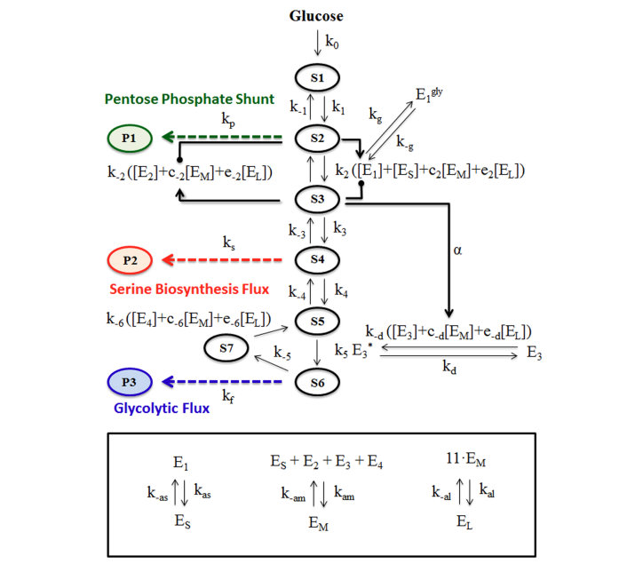

# 🧬 Biomedical Engineering

## *️⃣ Motivation
During my coursework at Lafayette, I chose biomedical systems as one of my ECE electives and was immediately drawn to the field. The combination of electrical and computer engineering principles with mathematical modeling, particularly through differential equations, and their application to healthcare and medicine was fascinating. While any engineering discipline contributes indirectly to society, I am motivated by the opportunity to make a more direct impact on people’s health and quality of life. The highlights below showcase several experiments and projects I have completed. Full documentation is available in the folders above.

---

## 1️⃣ Mathematical Model of Enzyme Clustering on Glucose Metabolism for Cancer Treatment
Interpreting scientific papers is a challenging but essential skill in biomedical engineering. To strengthen this ability, I analyzed “A Mathematical Model for Enzyme Clustering in Glucose Metabolism” by Miji Jeon. This paper, which applies mathematical modeling to a biological process I find particularly interesting, serves as the foundation for the discussion in this section. You can find the full reference linked at the end of the paper.

Cancer cells reprogram their metabolism to prioritize growth. This is often done by altering enzyme functions and forming clusters called glucosomes to redirect glucose metabolism to different metabolic pathways. The three metabolic pathways in this instance are glycolysis, pentose phosphate pathway, and serine biosynthesis. This study investigates how these clusters affect these key metabolic pathways by creating a mathematical model. The experiment aims to understand how changes in cluster size and enzyme activity influence cancer metabolism. If a pathway experiences an increase in activity, we can determine cancer cells rely more on those biochemical reactions. If a pathway experiences a decrease in activity, it indicates a loss of normal cellular function that can be exploited in combating cancer and potentially revealing new targets for therapy.

 

 

 

 

 

 

 

 

 

## 2️⃣ Comparative Analysis of Enzymatic and Non-Enzymatic Biosensors for Glucose Detection
