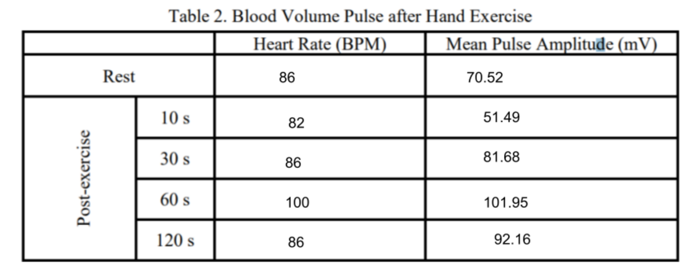

# 🧬 Biomedical Engineering

## *️⃣ Motivation
During my coursework at Lafayette, I chose biomedical systems as one of my ECE electives and was immediately drawn to the field. I am particularly fascinated by the intersection of electrical and computer engineering with systems physiology, bioinstrumentation, and computational modeling, where mathematical analysis and differential equations are used to understand and simulate complex biological processes. This foundation has enabled me to design and analyze physiological measurement systems, develop cardiovascular and respiratory simulations, and implement signal acquisition and processing techniques. I am motivated by the opportunity to directly improve health outcomes and patient care through advanced monitoring devices and emerging fields like biophotonics, which integrates optics and electronics to probe and image biological tissue. The projects and experiments highlighted below demonstrate my ability to apply rigorous engineering principles to real-world biomedical challenges.

---

## 1️⃣ Mathematical Model of Enzyme Clustering in Glucose Metabolism for Cancer Treatment
Interpreting scientific papers is a challenging but essential skill in biomedical engineering. To strengthen this ability, I analyzed “A Mathematical Model for Enzyme Clustering in Glucose Metabolism” by Miji Jeon. This paper, which applies mathematical modeling to a biological process I find particularly interesting, serves as the foundation for the discussion in this section. You can find the full reference linked at the end of the paper.

Cancer cells reprogram their metabolism to prioritize growth. This is often done by altering enzyme functions and forming clusters called glucosomes to redirect glucose metabolism to different metabolic pathways. The three metabolic pathways in this instance are glycolysis, pentose phosphate pathway, and serine biosynthesis. This study investigates how these clusters affect these key metabolic pathways by creating a mathematical model. The experiment aims to understand how changes in cluster size and enzyme activity influence cancer metabolism. If a pathway experiences an increase in activity, we can determine cancer cells rely more on those biochemical reactions. If a pathway experiences a decrease in activity, it indicates a loss of normal cellular function that can be exploited in combating cancer and potentially revealing new targets for therapy.

 

 

 

 

 

 

## 2️⃣ Comparative Analysis of Enzymatic and Non-Enzymatic Biosensors for Glucose Detection
Abstract - Glucose monitoring is essential in managing diabetes and other metabolic disorders. This drives advancements in sensor technologies for integration into electronic and wearable devices. This paper presents a comparative analysis of enzymatic and non-enzymatic electrochemical biosensors for glucose detection. Enzymatic sensors, which rely on glucose oxidase or dehydrogenase, offer high specificity and have been successfully implemented in commercial self-monitoring and continuous glucose monitoring systems. However, limitations such as enzyme degradation, oxygen dependency, and calibration requirements have led to growing interest in non-enzymatic alternatives. These fourth-generation sensors utilize metal-based catalysts (e.g., Ni, Pt, Au) to directly oxidize glucose. This offers advantages in stability, miniaturization, and reagent-free operation. The paper explores the underlying mechanisms, materials, performance metrics, and integration challenges of both approaches supported by recent literature. System-level considerations such as linearity, selectivity, detection limits, and clinical accuracy frameworks are examined to assess suitability for next-generation wearable biosensing platforms.

## 3️⃣ Biomedical Systems Laboratory Work
As part of my biomedical systems coursework, I completed a series of labs designed to measure and analyze physiological signals across multiple organ systems. Together, these projects developed my ability to integrate electrical/computer engineering tools with mathematical modeling and data analysis in the context of human health. These included: 
- Recording and processing electrocardiogram (ECG) data to detect heart rate
- Using electroencephalography (EEG) to extract alpha rhythms
- Studying cardiovascular responses to exercise
- Performing spirometry to characterize respiratory cycles, lung volumes, forced expiration, and the effects of bronchial obstruction.
---

### Electrocardiogram Recording and Heart Rate Detection
In this lab, we recorded ECG signals from a human subject using an ADInstruments PowerLab system and processed the data in MATLAB to detect heartbeats. We implemented a peak detection algorithm to calculate heart rate over time and compared the results against measurements obtained directly from LabChart. Our analysis showed consistent agreement between the algorithm and LabChart, with the subject’s heart rate generally in the 60–80 bpm range.

 

 

 

---
### Electroencephalography Recording and Alpha Rhythm Extraction
In this lab, we recorded EEG signals to study two key aspects: recognizing artifacts and detecting alpha waves. First, we identified common artifacts in EEG recordings, including eye blinks, eye movements, and head motion, which often introduced large-amplitude noise beyond the normal ±50 µV range.
Next, we examined alpha rhythms (8–13 Hz), which are typically present when subjects are relaxed with eyes closed and diminish upon eye opening. While we observed spectral peaks in the alpha band during eyes-closed conditions, the expected reduction with eyes open was less pronounced in our data. This discrepancy likely stemmed from electrode placement issues and poor signal quality, but the experiment still demonstrated the characteristic frequency range of alpha activity and highlighted the importance of minimizing artifacts in EEG acquisition.

 

  
  

 

  
  

 

---
### Cardiovascular Effects of Exercise
In this lab, we recorded ECG signals and finger blood volume pulses to examine the physiological effects of exercise. We first measured baseline heart rate and pulse amplitude at rest, then had the volunteer perform short bouts of physical activity, and recorded the immediate post-exercise responses. A hand-exercise protocol was also included to observe localized changes in blood flow. Analysis showed that heart rate increased and R-R intervals decreased immediately after exercise, while pulse amplitude at the fingers temporarily dropped due to blood redistribution to active muscles. During recovery, both heart rate and pulse amplitude gradually returned to baseline values. This demonstrated the dynamic control of cardiovascular responses by the nervous system.

 

 

 

 

 

 

 

---
### Spirometry Characterization of Respiration Functions
In this lab, we used spirometry to study respiratory function under different conditions. These included normal breathing, forced breathing, and simulated airway obstruction. During normal tidal breathing, we measured key respiratory parameters tidal volume, inspiratory reserve volume, and vital capacity, and compared experimental values with those generated by the spirometry software. Small discrepancies arose, largely due to manual estimation of measurement points and limitations in the extension module, but the results aligned with physiological expectations.

When performing forced breathing maneuvers, peak inspiratory flow (PIF), peak expiratory flow (PEF), and forced vital capacity (FVC) were quantified. The data highlighted the efficiency of the respiratory system during maximal effort, though our measured values for forced expiratory volume in one second (FEV1) were lower than expected. This likely reflected experimental error or suboptimal effort during exhalation.

Finally, we simulated bronchial obstruction by restricting the airway and repeating the forced breathing test. This resulted in significant decreases in FVC, PEF, and PIF, and illustrated how narrowed airways impair airflow. These findings mirror the physiological limitations observed in conditions such as asthma, where airflow obstruction reduces pulmonary function. Overall, this lab demonstrated how spirometry provides quantitative insight into lung volumes, flow rates, and the effects of both normal and pathological respiratory states.

 

 

 

  
 <b>Normal Breathing</b>

 

  
 <b>Forced Breathing</b>

 

  
 <b>Obstructed Breathing</b>

 

## 4️⃣ Cardiovascular System Modeling for Biomedical Applications
In this project, I developed and simulated a lumped-parameter model of the cardiovascular system using MATLAB/Simulink. I represented the left ventricle as a time-varying elastance function to capture the cyclic pressure–volume relationship during systole and diastole. The systemic circulation was modeled with a four-element Windkessel circuit consisting of electronic elements to approximate arterial compliance, vascular resistance, and inertance of blood flow. I also incorporated ideal diodes and resistors to represent the mitral and aortic valves to ensure unidirectional flow and pressure-dependent valve opening. Together, these components provided a simplified but physiologically grounded model of systemic hemodynamics.

 

 

 

Running the simulation at a normal heart rate of 72 bpm generated ventricular, atrial, and aortic pressure traces as well as left ventricular volume over time. From these results, I calculated key hemodynamic variables including cardiac output, stroke work, systolic and diastolic pressures, and mean atrial pressures. My measured values were within expected physiological ranges, confirming the validity of the model. To extend the analysis, I systematically varied contractility (Emax), preload, and afterload. Increasing systemic resistance raised systolic pressure and reduced cardiac output, consistent with the hemodynamic effects of hypertension. Reducing venous return decreased end-diastolic volume and stroke volume, reflecting the sensitivity of the Frank-Starling mechanism to preload. By contrast, increasing contractility produced higher pressures and greater stroke work for the same preload and afterload conditions, illustrating how ventricular elastance is a central determinant of pump performance.

I also performed regression analysis on end-systolic pressure–volume points across different conditions to estimate ventricular elastance and the unstressed volume. These fitted values closely matched the original model parameters, confirming the utility of pressure–volume analysis as a method for quantifying contractile function. This exercise not only demonstrated how computational models can replicate key features of human circulation but also underscored their value in interpreting measurements from biomedical devices such as echocardiography, catheterization, or pressure-volume loop analysis systems. The ability to simulate perturbations—such as increased afterload or reduced preload—highlighted how mathematical modeling complements experimental tools in understanding cardiovascular pathology, including hypertension, heart failure, and valvular disease.

 

 

 

After running my initial simulation, I implemented a theoretical rotary ventricular assist device (VAD) to divert blood flow away from the failing ventricle. To integrate the pump flow Q into the cardiovascular model, I modified the nodal equations at the pump inlet (Plv) and outlet (Psa). For the left ventricle, Plv depends on the ventricular volume Vlv. I subtracted the pump flow Q from the original relation (Qmv - Qao) before integration, effectively bypassing the ventricle and reducing its workload. For the systemic arteries, Psa depends on arterial volume Vs. I added the pump flow Q to the original relation (Qao - Qs) before integration, ensuring that systemic circulation was maintained despite reduced ventricular output. This modification captured the physiological role of the VAD—offloading the left ventricle while sustaining systemic blood flow.

 

 

 

 

 

 

 

 

 

## 5️⃣ Modeling Oxygen Transport in the Respiratory System
I implemented an oxygen (O2) transport model in Simulink using a respiration system framework with physiological parameters: atmospheric pressure (PATM = 760 mmHg), alveolar O2 fraction (γATX = 0.21), airflow rate (FB = 80 ml/sec), maximum O2 fraction in blood (MAX = 0.224), and venous O2 partial pressure (PVX = 40 mmHg). Hemoglobin saturation was incorporated using a lookup table relating O2 partial pressure to percent saturation to accurately capture the nonlinear O2 dissociation curve.

 

 

 

I simulated alveolar O2 concentration at respiratory rates of 10 and 15 breaths per minute. Higher rates increased alveolar O2 levels. This demonstrated how ventilation frequency directly affects oxygen replenishment. I also varied spontaneous breathing effort by adjusting pleural pressure (PB) amplitudes at 1200 and 1500 dynes/cm² at 15 breaths per minute. Greater inspiratory effort increased tidal volumes and alveolar O2 concentration, which highlighted how respiratory mechanics influence oxygen transport.

 

 

 

This project has clear biomedical applications, as it illustrates how ventilation parameters—rate and inspiratory effort—impact oxygen delivery. Such insights are critical for designing and optimizing respiratory support devices like ventilators, and for understanding patient responses in conditions such as hypoventilation or restrictive lung disease. The model bridges theoretical respiratory dynamics with practical clinical considerations in oxygen transport.

 

 

 

 

 

 
